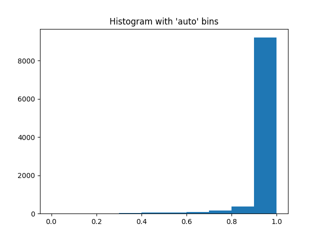
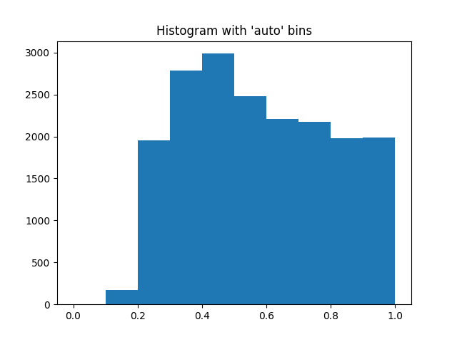

# TRADI_Tracking_DNN_weights

This repository contains a PyTorch implementation of [TRADI: Tracking deep neural network weight distributions](https://arxiv.org/abs/1912.11316)
For now, there are just the codes on MNIST, we will try to add the Camvid code.
The codes for MNIST are on the folder MNIST_TASK. 

To launch the codes please go to the MNIST folder and then type:
 
    
    python main_train_TRADI.py 
    

#### Results 
We can the results of the Maximum class probability for a TRADI DNN.  

